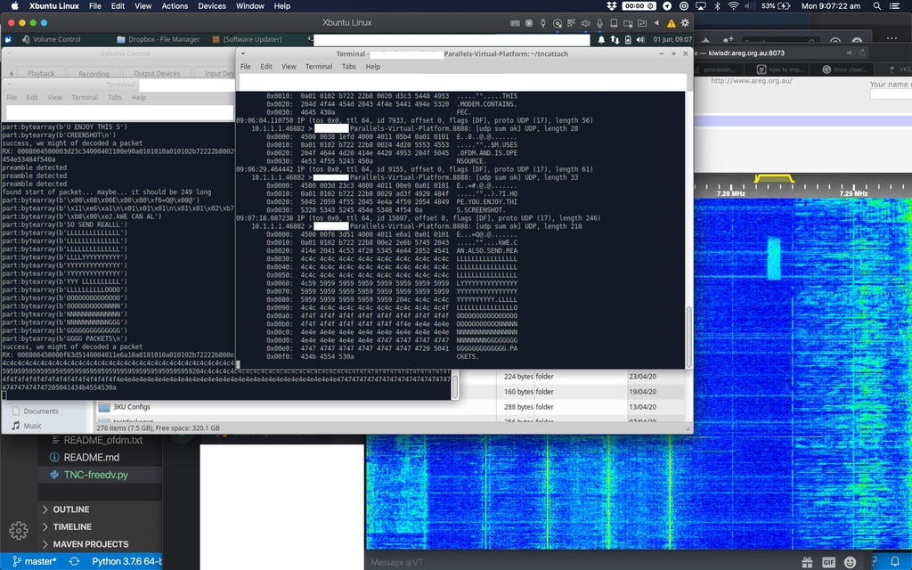

FreeDV-TNC
==

**This version hasn't been tested on air but has been simulated locally. Your milage may vary. Please log a github issue with your feedback*

This code interfaces FreeDV 700D modem with a virtual KISS serial port that can be used with tools like APRS, kissattach and tncattach. This was an experiment to try to make an existing opensource modem KISS compatiable that had better performance than the typical Bell 103 300 baud modem.

This was also an experiment to see if FreeDV could be interfaced with using Python




Limited testing has been performed.

Credits
--
David Rowe and the FreeDV team for developing the modem and libraries 

Notes
--
For Windows and macos users, use --tcp to start a TCP server for the KISS interface.

I've added a small amount of basic flow control (max packets to send before requiring waiting for a little bit). I'm not sure if it's meant to be the TNCs job to do this flow control considering higher layers also do it - though most assume you can do full duplex.

At the moment the modem isn't particularly happy if it doesn't get fed noise. This isn't a problem on HF as we get plenty of noise for free, but if your using squelch on VHF or UHF this could be a problem. This is something I need to look into

Configuration
--

An ICOM IC-7100 was used for testing but other rigs that support SSB should work fine.

### Install Codec2
```
git clone https://github.com/drowe67/codec2.git
cd codec2
mkdir build_linux
cd build_linux
cmake ../
make
sudo make install
sudo ldconfig
```

### Install
```
sudo apt-get install portaudio19-dev
pip3 install freedvtnc
```

### Installing rigctld (optional)
Rigctl is used to key the radio when transmitting. VOX can be used but is not recommended
```
apt-get install libhamlib-utils libhamlib-dev
```

### Installing tncattach (optional)
tncattach is used here as a test, however you can use any KISS software with this modem.
more here: https://unsigned.io/ethernet-and-ip-over-packet-radio-tncs/
```
git clone https://github.com/markqvist/tncattach.git
cd tncattach
make
make install
```

### Starting the TNC
```
rigctld -m 370 -r /dev/ttyUSB0 & # Start rigctld and background. If your RX only you can use -m 1 for the dummy interface

freedvtnc --list-sound-devices # find your sound card or if using pulse just use "pulse" in the next command

freedvtnc --rx-sound-device "USB Audio CODEC: - (hw:3,0)" --tx-sound-device "USB Audio CODEC: - (hw:3,0)" 
```

The program should then say `TNC port is at : /dev/pts/22`. This is the serial port you can use in your applications as a TNC

For example with tncattach:
```
sudo tncattach /dev/pts/22 115200 --mtu 1400 -v
```


Command line arguments
==
```
usage: freedvtnc [-h] [--modem {700D}] [--rx-sound-device RX_SOUND_DEVICE]
                 [--tx-sound-device TX_SOUND_DEVICE] [--list-sound-devices]
                 [--sample-rate SAMPLE_RATE]
                 [--rigctl-hostname RIGCTL_HOSTNAME]
                 [--rigctl-port RIGCTL_PORT] [--vox] [--no-pty] [--no-tx]
                 [-v] [--stdout] [--tcp] [--preamble-length PREAMBLE_LENGTH]
                 [--min-tx-wait MIN_TX_WAIT]

FreeDV Data Modem TNC

optional arguments:
  -h, --help            show this help message and exit
  --modem {700D}        The FreeDV Modem to use. Currently only 700D is
                        supported
  --rx-sound-device RX_SOUND_DEVICE
                        The sound card used to rx
  --tx-sound-device TX_SOUND_DEVICE
                        The sound card used to tx
  --list-sound-devices  List audio devices
  --sample-rate SAMPLE_RATE
                        Sample rate of the soundcard.
  --rigctl-hostname RIGCTL_HOSTNAME
                        Hostname or IP of the rigctld server
  --rigctl-port RIGCTL_PORT
                        Port for rigtctld
  --vox                 Disables rigctl
  --no-pty              Disables serial port
  --no-tx               Disables serial port
  -v                    Enables debug log
  --stdout              RX data stdout
  --tcp                 Enabled the TCP Server (listens on 0.0.0.0:8001

Advanced TNC Tuneable:
  These settings can be used to tune the TNC

  --preamble-length PREAMBLE_LENGTH
                        Number of preamble frames to send
  --min-tx-wait MIN_TX_WAIT
                        The TNC will wait this value in seconds + a random
                        amount of seconds between 0 and 2

```


Terms
==
Just some terms I use inside the code.


*FreeDV Frame* - This is the data sent and received from the 700D modem. For example with the 700D modem a frame is 14 bytes. It's the smallest amount of data we deal with in the TNC.

*Kiss Frame* - The kiss frame, This can be very long and is typically spread over multiple freedv frames.

*Packet* - Within the TNC code, a packet refers to the on air packet which is typically one kiss frame (not to be confused with a FreeDV frame) and split into multiple freedv frames